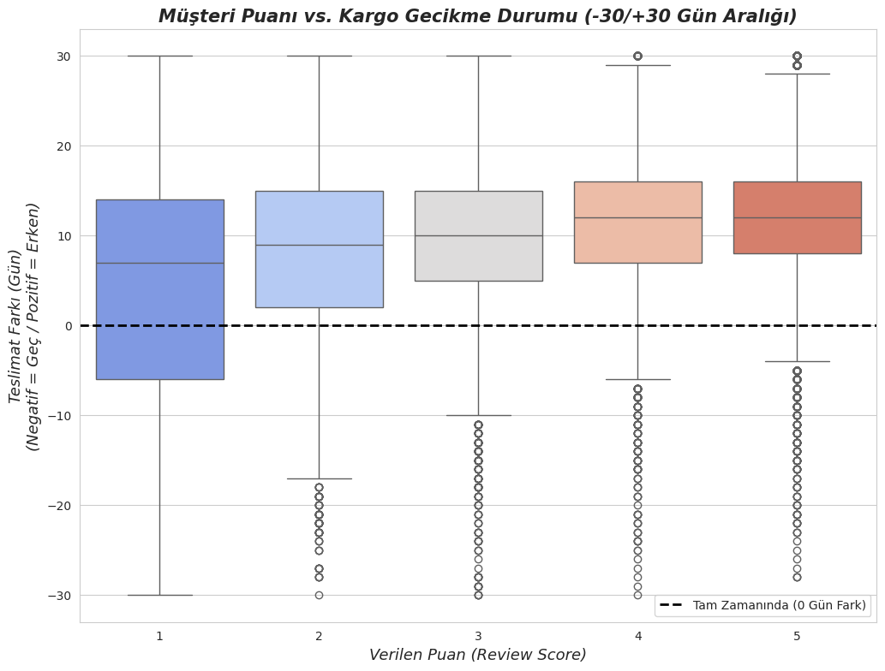
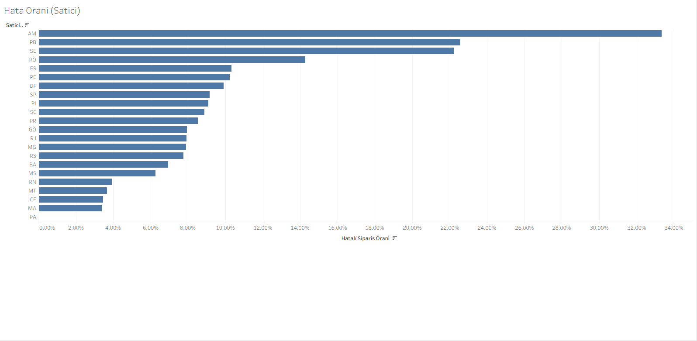

# E-Ticaret Analizi: Müşteri Memnuniyeti ve Hizmet Kalitesi

Bu proje, Brezilya'nın en büyük e-ticaret platformlarından biri olan Olist'in 9 farklı veritabanı tablosunu birleştirerek, müşteri memnuniyetini (review score) etkileyen kök nedenleri araştıran bir İş Zekası (BI) analizidir.

**Canlı Dashboard:**
[Projenin interaktif Tableau Dashboard'unu incelemek için buraya tıklayın.](https://public.tableau.com/app/profile/enes.demir/viz/E-CommerceMteriMemnuniyetiDashboard/Dashboard1?publish=yes
)
**Kullanılan Araçlar:** Python, Pandas (Veri Hazırlama), Matplotlib/Seaborn (İlk Analiz),Gemini (AI Yardımcı), **Tableau** (Nihai Dashboard)

## Proje Adımları

1.  **Veri Hazırlama (Python & Pandas):** 9 ayrı CSV dosyası Pandas kullanılarak `order_id`, `customer_id` gibi anahtarlar üzerinden birleştirildi.
2.  **Yeni Özellik:** Ham tarih verilerinden müşterinin kargo tecrübesini ölçen `GecikmeGunu` (delivery\_delta\_days) adında yeni bir özellik türetildi.
3.  **İlk Analiz (Python & Seaborn):** "Kargo gecikmesi puanı etkiler mi?" sorusunu cevaplamak için `GecikmeGunu` ve `review_score` arasında bir Kutu Grafik (Box Plot) analizi yapıldı.
4.  **Asıl Neden Analizi (Tableau):** İlk analizde ortaya çıkan anormallik (kargosu erken gelip 1 puan verenler), "Hata Oranı" adında yeni bir hesaplanmış alan (`Calculated Field`) oluşturularak Tableau üzerinde derinlemesine incelendi.

## Analiz Yorumları (Insights)

### Yorum 1 (Box Plot):

İlk analiz (Box Plot), düşük puanların ana nedeninin genellikle kargo gecikmesi **olmadığını** ortaya çıkardı.
Grafik, 1 puan veren müşterilerin medyan (ortanca) tecrübesinin kargoyu gecikmeli değil, tam tersine **yaklaşık 7 gün *erken* almak** olduğunu gösterdi. Bu durum, memnuniyetsizliğin kök nedeninin kargo hızından bağımsız, **başka bir nedeni olduğuna işaret etti.

### Yorum 2 (Tableau):

Sadece "en çok 1 puan alan" kategorilere bakmak, yüksek satış hacmi (`bed_bath_table`sütunu gibi) nedeniyle yanıltıcıydı.
Bu yanılgıyı ortadan kaldırmak için Tableau'da **`Hata Oranı`** adında yeni bir metrik oluşturdum:
Bu analize göre, asıl sorun yaratan kategorilerin, satış hacmi düşük ancak hizmet kalitesi felaket olan kategoriler olduğu tespit edildi:

* **`security_and_services`:** Bu kategoride, kargosu zamanında gelen **her 2 siparişten 1'i (%50 Hata Oranı)** 1 puan almıştır.
* **`diapers_and_hygiene`:** Bu kategoride, kargosu zamanında gelen **her 3 siparişten 1'i (%32 Hata Oranı)** 1 puan almıştır.

Bu bulgu, şirketin kargo optimizasyonundan çok, bu kritik kategorilerdeki satıcıların denetimine ve ürün kalitesine odaklanması gerektiğini göstermektedir.

