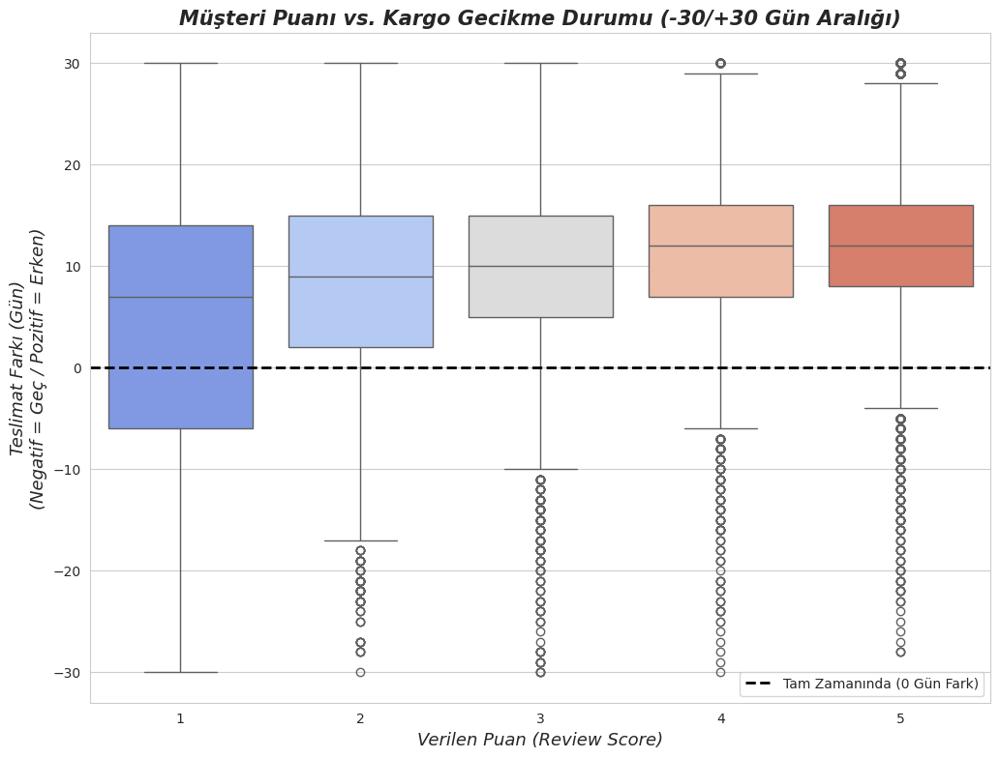
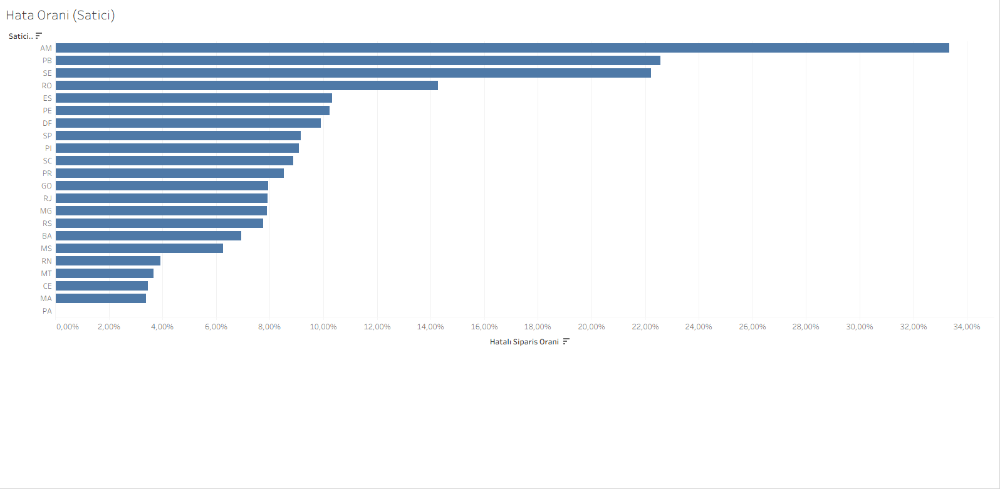

# E-Commerce BI Project: Customer Satisfaction and Service Quality Analysis

## Project Overview

This project analyzes the **Olist Brazilian E-Commerce dataset** by combining 9 related database tables to investigate the root causes behind customer satisfaction scores.

The goal is not only to describe review scores, but to understand **which operational problems may be driving low customer satisfaction** and how a BI dashboard can support better decision-making.

---

## Live Dashboard

[View the interactive Tableau Dashboard](https://public.tableau.com/app/profile/enes.demir/viz/E-CommerceMteriMemnuniyetiDashboard/Dashboard1?publish=yes)

---

## Tools Used

- Python and Pandas for data preparation
- Matplotlib / Seaborn for initial exploratory analysis
- Tableau for the final dashboard
- AI-assisted support for analysis planning and interpretation checks

---

## Project Steps

1. **Data Preparation with Python and Pandas**  
   Combined 9 separate CSV files using keys such as `order_id` and `customer_id`.

2. **Feature Engineering**  
   Created `GecikmeGunu` (`delivery_delta_days`) from raw date fields to measure the customer's delivery experience.

3. **Initial Exploratory Analysis**  
   Used a box plot to test whether delivery delay explains low review scores.

4. **Root-Cause Analysis in Tableau**  
   After detecting an anomaly among low-score orders, created a calculated field called `Hata Oranı` to analyze problematic product categories more carefully.

---

## Key Insights

### 1. Delivery Delay Was Not the Main Explanation

The first box plot showed that low review scores were not mainly explained by late delivery.

In fact, the median delivery experience of customers who gave a 1-star review showed that their orders arrived around **7 days earlier** than expected. This suggested that dissatisfaction was likely driven by another factor beyond delivery speed.

### 2. Sales Volume Alone Was Misleading

Looking only at categories with the highest number of 1-star reviews was misleading because high-volume categories such as `bed_bath_table` naturally produced more complaints.

To reduce this bias, a new Tableau metric called **`Hata Oranı`** was created. This metric helped identify categories with lower sales volume but much worse service quality.

The most problematic categories were:

- **`security_and_services`**: among on-time deliveries, 1 out of every 2 orders received a 1-star review (**50% error rate**).
- **`diapers_and_hygiene`**: among on-time deliveries, 1 out of every 3 orders received a 1-star review (**32% error rate**).

This finding suggests that the company should focus less on delivery-speed optimization alone and more on seller monitoring, product quality, and category-level service issues.

---

## Business Value

This project demonstrates how BI analysis can move from a simple dashboard question — **"Which categories receive low scores?"** — to a stronger business question: **"Which categories perform poorly even when delivery is on time?"**

That shift makes the analysis more actionable for operations, seller management, and customer experience teams.
